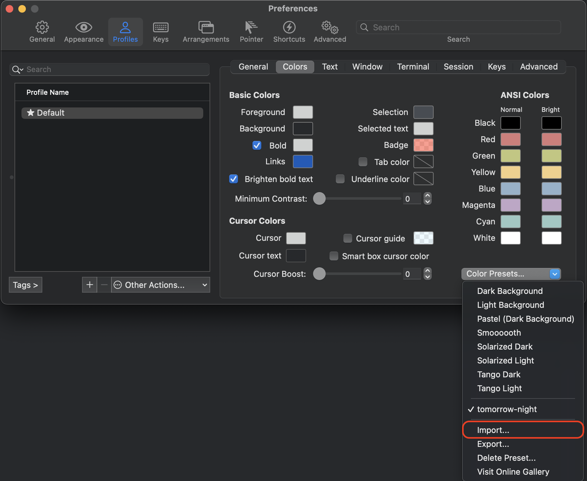
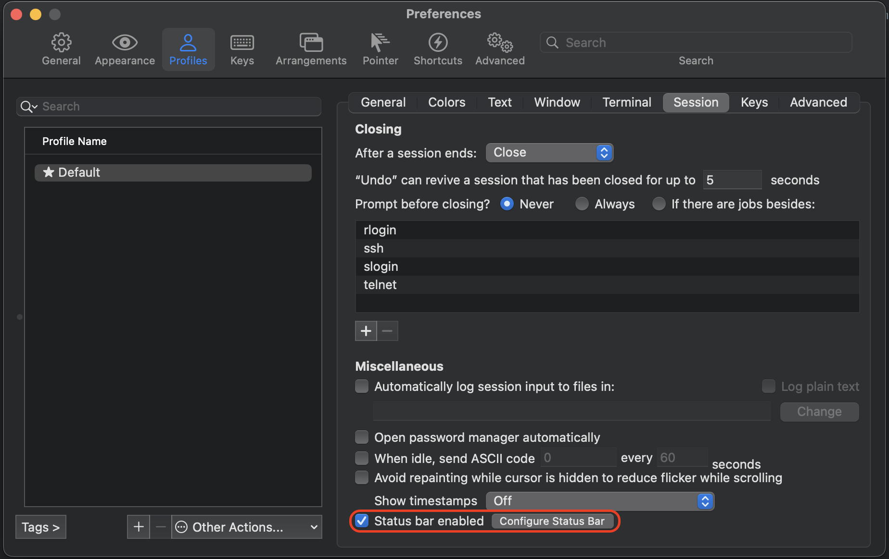

# dotfiles
## dotfiles
install dotfiles

* with options
  ```
  ./install -n "first-name last-name" -e "email"
  ```

* with env variables
  ```
  export name="first-name last-name"
  export email="email"
  ./install
  ```
## homebrew
install homebrew

```
/bin/bash -c "$(curl -fsSL https://raw.githubusercontent.com/Homebrew/install/HEAD/install.sh)"
```
install packages

```
brew bundle install
```
## iterm2
open preferences (⌘ + ,)

import and select color preset



enable configure status bar


